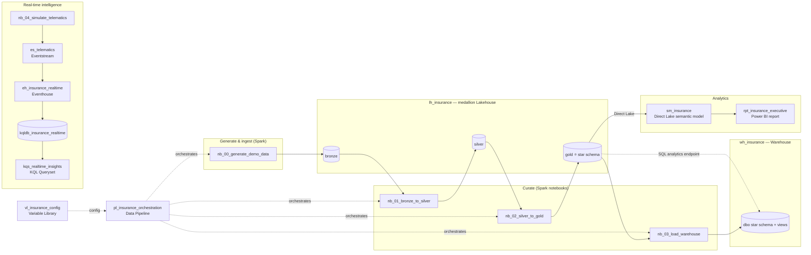

# Contoso Insurance — Microsoft Fabric end-to-end demo

A complete, **demo-data-driven** Microsoft Fabric workspace built around a single cohesive
**property & casualty (P&C) insurance** story — *Contoso Insurance*. It exercises **every
major Fabric workload** and is structured for **Git integration** and **dev → test → prod**
promotion with [`fabric-cicd`](https://microsoft.github.io/fabric-cicd/).

Everything is synthetic: [nb_00_generate_demo_data](workspace/nb_00_generate_demo_data.Notebook/notebook-content.py)
fabricates all source data, so there are **no external dependencies** to configure.

---

## The story

Contoso Insurance writes Auto, Home, Renters, Life and Umbrella policies through agents
across regions and channels. The platform answers the questions an insurance carrier cares
about:

- **Underwriting & growth** — written/earned premium by product, region, agent and channel.
- **Claims & profitability** — incurred losses, paid vs reported, **loss ratio**, severity bands.
- **Risk & fraud** — fraud flags, catastrophe events, and **real-time vehicle telematics**
  (harsh braking / speeding) streamed from a connected-car fleet.

---

## Architecture



**Medallion flow:** raw `bronze` → conformed `silver` → analytics-ready `gold` star schema,
all as Delta tables inside one schema-enabled lakehouse. The **Warehouse** rebuilds the star
schema in `dbo` via T-SQL CTAS for SQL consumers, and the **Lakehouse SQL analytics endpoint**
exposes the same `gold` tables to T-SQL with zero copy. The **semantic model** reads `gold`
directly via **Direct Lake**, powering the **executive Power BI report**.

---

## Item inventory

| Item | Type | Purpose |
|---|---|---|
| [lh_insurance](workspace/lh_insurance.Lakehouse/) | Lakehouse | Medallion `bronze`/`silver`/`gold`; SQL analytics endpoint over `gold`. |
| [wh_insurance](workspace/wh_insurance.Warehouse/) | Warehouse | `dbo` star schema (CTAS from `gold`) + analytics views for T-SQL/BI. |
| [nb_00_generate_demo_data](workspace/nb_00_generate_demo_data.Notebook/) | Notebook | Synthesizes all customers, agents, policies, claims, premium into `bronze`. |
| [nb_01_bronze_to_silver](workspace/nb_01_bronze_to_silver.Notebook/) | Notebook | Cleans/conforms bronze → curated `silver`. |
| [nb_02_silver_to_gold](workspace/nb_02_silver_to_gold.Notebook/) | Notebook | Builds the `gold` dimensional star + `kpi_monthly`. |
| [nb_03_load_warehouse](workspace/nb_03_load_warehouse.Notebook/) | Notebook | Triggers the Warehouse CTAS build from `gold`. |
| [nb_04_simulate_telematics](workspace/nb_04_simulate_telematics.Notebook/) | Notebook | Optional fleet telematics generator feeding the real-time path. |
| [pl_insurance_orchestration](workspace/pl_insurance_orchestration.DataPipeline/) | Data Pipeline | Chains generate → bronze→silver → silver→gold → load warehouse. |
| [eh_insurance_realtime](workspace/eh_insurance_realtime.Eventhouse/) | Eventhouse | Real-time store for vehicle telematics. |
| [kqldb_insurance_realtime](workspace/kqldb_insurance_realtime.KQLDatabase/) | KQL Database | Telematics tables, `DriverRiskScore` function, materialized view. |
| [es_telematics](workspace/es_telematics.Eventstream/) | Eventstream | Streams sample telematics into the Eventhouse. |
| [kqs_realtime_insights](workspace/kqs_realtime_insights.KQLQueryset/) | KQL Queryset | Saved KQL tabs: driver risk, live fleet, harsh-event hotspots. |
| [sm_insurance](workspace/sm_insurance.SemanticModel/) | Semantic Model | Direct Lake model over `gold` with claims & premium measures. |
| [rpt_insurance_executive](workspace/rpt_insurance_executive.Report/) | Report | Executive overview: KPIs, product mix, loss-ratio trend, regional table. |
| [vl_insurance_config](workspace/vl_insurance_config.VariableLibrary/) | Variable Library | Per-environment config (`dev`/`test`/`prod` value sets). |

### `gold` star schema

- **Dimensions:** `dim_customer`, `dim_agent`, `dim_policy`, `dim_coverage`, `dim_date`
- **Facts:** `fact_claim`, `fact_premium` (+ `kpi_monthly` aggregate)

---

## Repository layout

```
workspace/        Fabric items in Git source format  + parameter.yml (fabric-cicd)
sql/
  warehouse/      T-SQL: 01 build star schema (CTAS), 02 analytics views
  lakehouse_sql_endpoint/  T-SQL exploration over the gold SQL analytics endpoint
kql/              KQL: 01 setup tables, 02 real-time demo queries
deploy/           deploy.py (fabric-cicd) + requirements.txt
.github/
  workflows/      deploy-fabric.yml (GitHub Actions CD)
  copilot-instructions.md, agents/, skills/, common/   Fabric SME toolkit (vendored)
```

---

## Prerequisites

- A Fabric-enabled capacity and **three workspaces** (dev / test / prod), or one to start.
- For automated deploys: a **service principal** that is an **Admin/Member** of each target
  workspace, with the Fabric/Power BI admin setting *"Service principals can use Fabric APIs"*
  enabled.
- Local tooling (optional): Python 3.10+, `az` CLI.

---

## Deploy: dev → test → prod

You can promote this repo two ways.

### Option A — Fabric Git integration (UI)
1. In the **dev** workspace: **Workspace settings → Git integration** → connect this repo and
   point it at the **`workspace/`** directory.
2. **Update all** to materialize every item.
3. Run the pipeline (below) to populate data.
4. For test/prod, repeat with their workspaces, or use Option B for hands-off promotion.

> Fabric Git integration only materializes recognized item folders; `workspace/parameter.yml`
> is ignored by Git sync and used **only** by fabric-cicd.

### Option B — fabric-cicd (CLI / CI)
```powershell
python -m venv .venv; .\.venv\Scripts\Activate.ps1
pip install -r deploy/requirements.txt
az login   # AzureCliCredential

python deploy/deploy.py --environment dev  --workspace-id <DEV_WORKSPACE_GUID>
python deploy/deploy.py --environment test --workspace-id <TEST_WORKSPACE_GUID>
python deploy/deploy.py --environment prod --workspace-id <PROD_WORKSPACE_GUID>
```

### Option C — GitHub Actions (CD)
[deploy-fabric.yml](.github/workflows/deploy-fabric.yml) auto-deploys to **dev** on push to
`main`, and supports manual `workflow_dispatch` to **dev/test/prod** (gated by GitHub
Environments).

Configure per environment (**Settings → Environments → dev | test | prod**):
- **Variable** `FABRIC_WORKSPACE_ID` — target workspace GUID
- **Secrets** `AZURE_CLIENT_ID`, `AZURE_TENANT_ID` — federated (OIDC) service principal

### How promotion stays GUID-free
No real workspace/item GUIDs are committed. [workspace/parameter.yml](workspace/parameter.yml)
rebinds everything at deploy time against the **target** workspace using fabric-cicd dynamic
variables:

| Bound reference | Resolved with |
|---|---|
| Pipeline notebook activities | `$items.Notebook.<name>.$id` |
| Pipeline / eventstream workspace ID | `$workspace.$id` |
| Eventstream → KQL database | `$items.KQLDatabase.kqldb_insurance_realtime.$id` |
| Queryset cluster URI | `$items.Eventhouse.eh_insurance_realtime.$queryserviceuri` |
| Semantic model Direct Lake source | `$workspace.$id` + `$items.Lakehouse.lh_insurance.$id` |

The report references the model **`byPath`**, which fabric-cicd auto-converts to a connection
at deploy — no parameterization needed.

---

## Test each workload

After deploying, run **`pl_insurance_orchestration`** once (or run nb_00 → nb_01 → nb_02 →
nb_03 manually) to populate the lakehouse and warehouse.

| # | Workload | How to validate |
|---|---|---|
| 1 | **Lakehouse SQL analytics endpoint** | Open `lh_insurance` → **SQL analytics endpoint**, run [sql/lakehouse_sql_endpoint/explore_sql_endpoint.sql](sql/lakehouse_sql_endpoint/explore_sql_endpoint.sql) against `gold.*`. |
| 2 | **Warehouse** | After `nb_03`, run [sql/warehouse/01_build_star_schema_ctas.sql](sql/warehouse/01_build_star_schema_ctas.sql) then [02_analytics_views.sql](sql/warehouse/02_analytics_views.sql); query `dbo.*` + views. |
| 3 | **Notebooks / Pipeline** | Run `pl_insurance_orchestration`; confirm all four activities succeed and `gold` tables populate. |
| 4 | **Real-time** | Start `es_telematics` (and/or run `nb_04_simulate_telematics`); open `kqs_realtime_insights` tabs or run [kql/02_realtime_queries.kql](kql/02_realtime_queries.kql) against `kqldb_insurance_realtime`. |
| 5 | **Semantic model** | Open `sm_insurance`; confirm Direct Lake tables load and measures (Loss Ratio, Net Incurred, Earned Premium…) evaluate. |
| 6 | **Power BI report** | Open `rpt_insurance_executive` — KPI cards, product-mix column chart, loss-ratio trend line, and regional table render from the model. |

---

## Conventions

- **Naming:** `lh_*` Lakehouse, `wh_*` Warehouse, `nb_*` Notebook, `pl_*` Pipeline,
  `eh_*` Eventhouse, `kqldb_*` KQL DB, `es_*` Eventstream, `kqs_*` KQL Queryset,
  `sm_*` Semantic model, `rpt_*` Report, `vl_*` Variable library.
- **No hardcoded GUIDs** in committed code — notebooks resolve IDs at runtime via
  `notebookutils`; cross-item links are parameterized via `parameter.yml`.
- Every item folder carries a `.platform` file with a **unique** `logicalId`.

See [.github/copilot-instructions.md](.github/copilot-instructions.md) for the full SME
working agreement and the vendored Fabric agents/skills toolkit.
